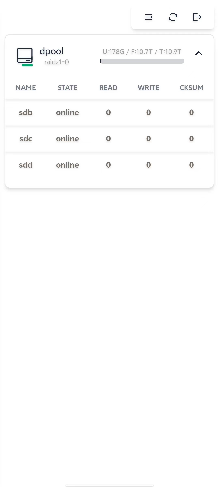
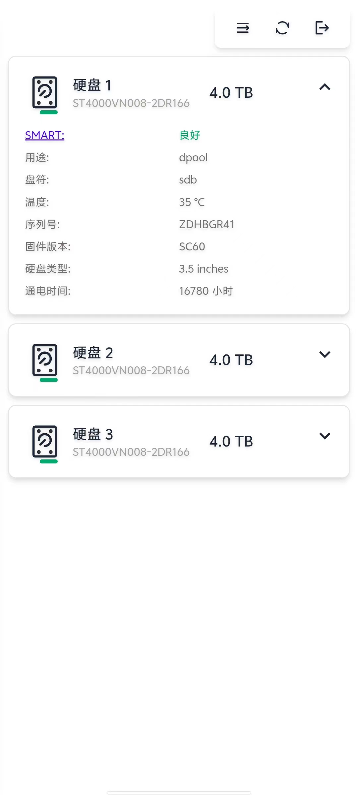
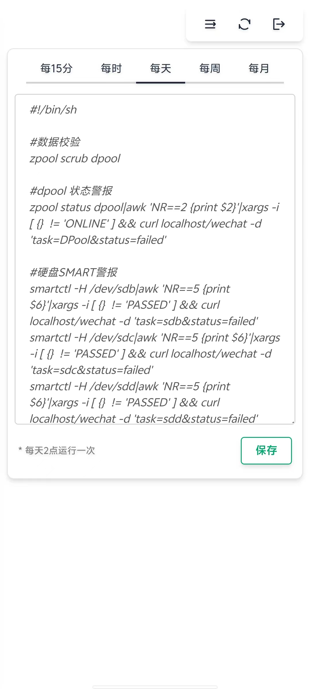

## 这是一套 基于 Alpine linux 系统为底层的 ZFS 监控系统, 由微信公众号测试平台 发出预警

```
用到技术栈有:
Golang vue daisyui
```

```
Alpine 必须安装软件如下:
zpool smartctl jq
```

```
公众号 模版内容 需如下:
任务:{{task.DATA}}
状态:{{status.DATA}}
```

```
登陆密码 默认为空,修改密码,需在 应用程序路径下 添加 pwd 文件 如:
echo '123456' > pwd
```

```
定时任务 依托与 系统的crontab 来执行 如:
#数据校验
zpool scrub dpool

#dpool 状态警报
zpool status dpool|awk 'NR==2 {print $2}'|xargs -i [ {}  != 'ONLINE' ] && curl localhost/wechat -d 'task=DPool&status=failed'

#硬盘SMART警报
smartctl -H /dev/sdb|awk 'NR==5 {print $6}'|xargs -i [ {}  != 'PASSED' ] && curl localhost/wechat -d 'task=sdb&status=failed'

#SMART 短测
smartctl -t short /dev/sdb

#SMART 长测
smartctl -t long /dev/sdb
```

```
zfs-web 文件为 Alpine 服务项 可自行修改里面路径 ,并复制这个文件到 /etc/init.d 文件夹,记得添加 执行权限, chmod +x zfs-web
添加开机默认启动
rc-update add zfs-web 
```








